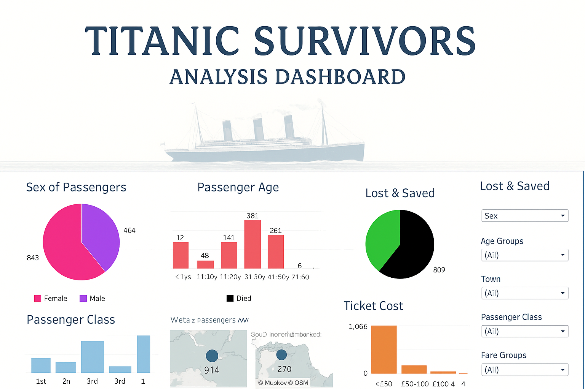

# 🚢 Titanic Survivors Analysis Dashboard



## 📊 Project Overview

This project — **Titanic Survivors Analysis Dashboard** — is an interactive **Tableau visualization** designed to explore the demographics and survival patterns of passengers aboard the RMS Titanic.  
Through engaging visuals, the dashboard provides insights into how **gender, passenger class, ticket fare, and age** influenced survival outcomes.

The goal of this project is to present complex historical data in a **visually appealing and easy-to-understand** way for data enthusiasts, analysts, and learners.

---

## 🧭 Dashboard Features

The Tableau dashboard includes the following visualizations:

1. **Sex of Passengers**
   - A pie chart representing the count of male vs. female passengers aboard the Titanic.
   - Highlights the gender imbalance among travelers.

2. **Passenger Age Distribution**
   - Bar chart dividing passengers into age groups.
   - Reveals which age ranges had the highest representation and survival rates.

3. **Lost & Saved**
   - A survival breakdown showing the ratio of passengers who survived versus those who didn’t.
   - Interactive filters allow analysis by gender, age group, or passenger class.

4. **Passenger Class**
   - Bar chart showing how many passengers belonged to 1st, 2nd, and 3rd class.
   - Demonstrates how socioeconomic status affected survival odds.

5. **Ticket Cost (Fare Groups)**
   - Distribution of passengers based on ticket fare ranges.
   - Used to identify patterns between fare price and survival likelihood.

6. **Embarkation Map**
   - Geographic visualization showing the number of passengers who boarded from different ports (Southampton, Cherbourg, Queenstown).

---
## Project Structure
```
📂 Titanic-Survivors-Analysis
│
├── titanic_preview.png # Dashboard image preview
├── data/
│ ├── Passenger_Class.csv # Dataset used for the dashboard
│
├── tableau/
│ ├── Titanic_Survivors_Dashboard.twbx # Tableau workbook
│
└── README.md # Project documentatio
└── LICENSE
```


## 🧾 Dataset Description

The dataset used for this dashboard is based on a **refined version of the classic Titanic dataset**.  
Each record corresponds to an individual passenger and includes the following fields:

| Column | Description |
|--------|--------------|
| **Class** | Passenger travel class (1st, 2nd, 3rd) |
| **Fare Groups** | Ticket fare grouped into categories such as `<£50`, `£50-100`, `£100-200`, `£200-300` |
| **Sex** | Passenger gender (Male/Female) |
| **Survived** | Survival status (Survived/Died) |
| **Town** | Port of embarkation (Southampton, Cherbourg, Queenstown) |
| **Age Groups** | Categorized age ranges such as `<1yrs`, `1-10yrs`, `21-30yrs`, etc. |
| **Name** | Passenger’s full name |
| **Age** | Actual age in years |
| **Fare** | Ticket price |
| **Number of Records** | Frequency or count of passengers in that record grouping |

**Example Data:**

| Class | Fare Groups | Sex | Survived | Town | Age Groups | Name | Age | Fare |
|--------|--------------|-----|-----------|------|-------------|------|------|------|
| 1st | £200-300 | Female | Survived | Southampton | 21-30yrs | Allen, Miss. Elisabeth Walton | 29 | 211.3375 |
| 1st | £100-200 | Male | Survived | Southampton | <1yrs | Allison, Master. Hudson Trevor | 0.9 | 151.55 |
| 1st | £100-200 | Female | Died | Southampton | 1-10yrs | Allison, Miss. Helen Loraine | 2 | 151.55 |

---

## 🎨 Key Insights

- **Females and children** had significantly higher survival rates compared to adult males.  
- **1st class passengers** were more likely to survive than 2nd or 3rd class passengers.  
- The **majority of passengers** boarded from **Southampton**, contributing to the highest number of casualties.  
- **Higher ticket fares** correlated positively with better survival chances.  

---

## 🛠️ Tools & Technologies Used

- **Tableau Desktop** – for creating and designing the dashboard  
- **Microsoft Excel / CSV** – for data preprocessing and cleaning  
- **GitHub** – for project hosting and version control  

---

🧑‍💻 Author

 ### Dinesh Barri
      Data Analyst & Data Scientist
     📍 Passionate about transforming data into visual stories using Machine Learning and BI tools.
        Linkedin : https://www.linkedin.com/in/dinesh-barri/
📜 License

    This project is released under the MIT License.
    You are free to use, modify, and distribute it with attribution.

